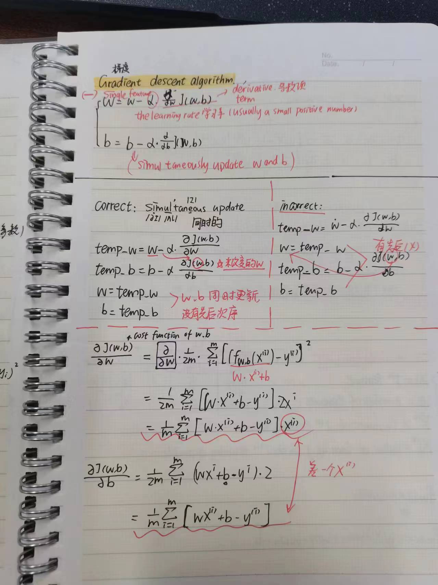
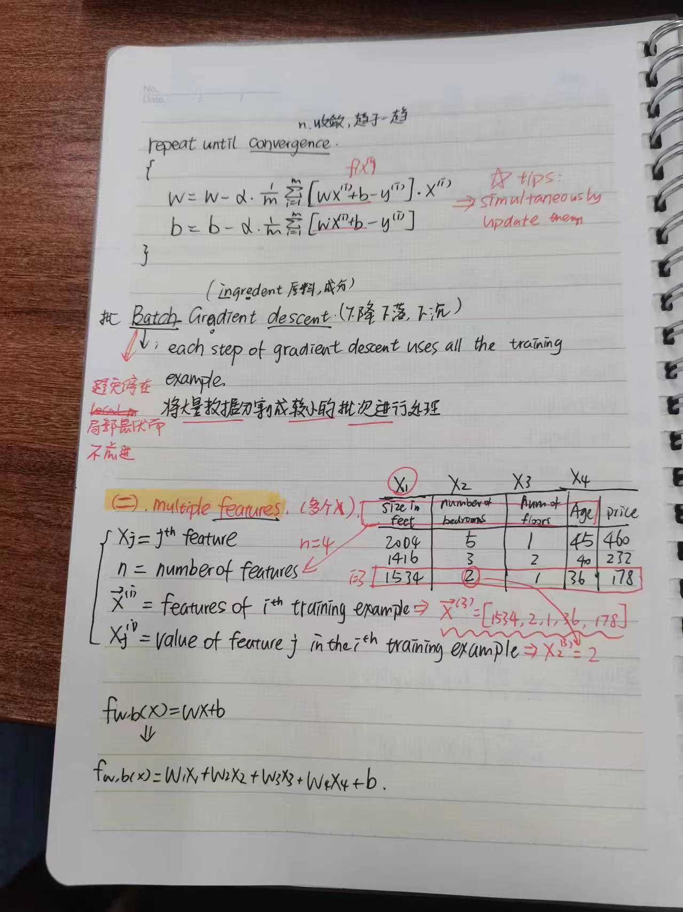
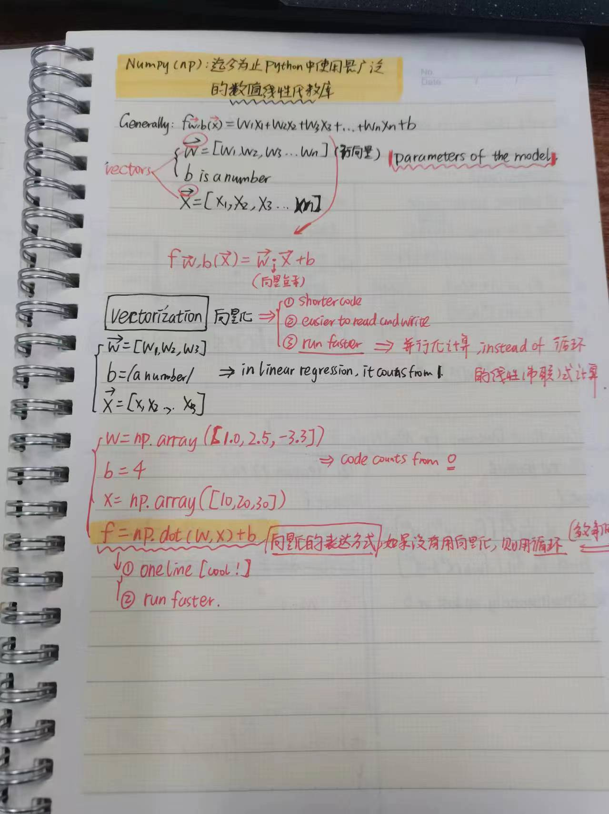
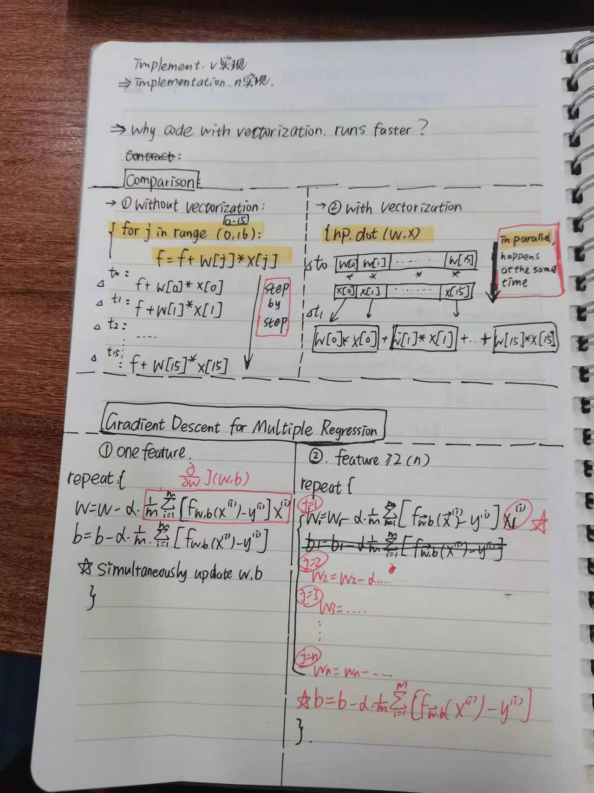
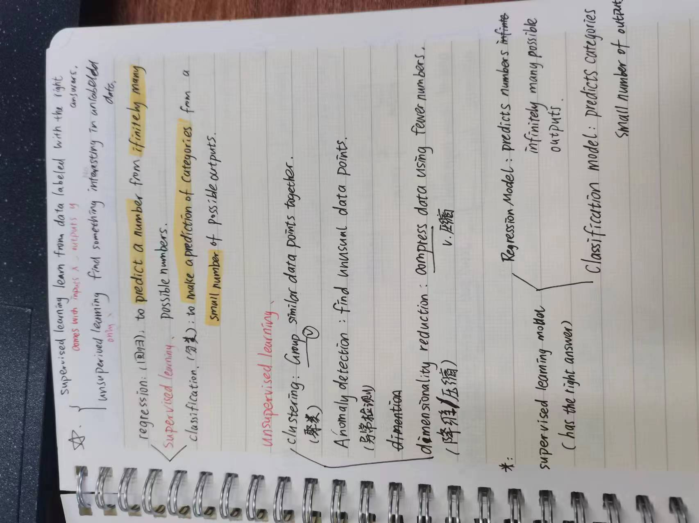
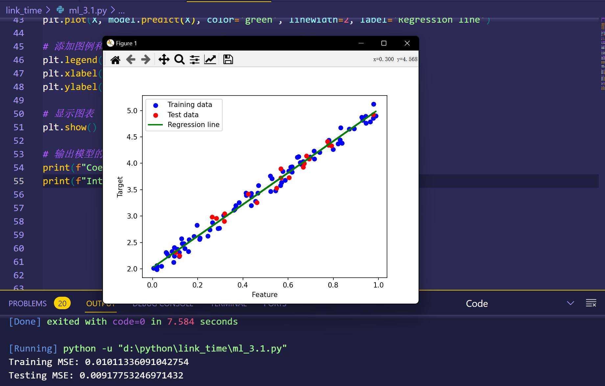

# 线性回归

### 一.什么是线性:  

线性指的是自变量与因变量之间的关系是线性的,可以用一条直线把自变量因变量的关系在图像上拟合出来.  

### 二.什么是回归:  

回归指的是找到一个数学模型,使这个模型可以最好的拟合自变量因变量之间的关系,使模型的损失函数最小.  

### 三.线性回归作用:  

用于研究两个或多个变量之间关系,且这种关系可以用直线描述.
用于建立数学模型,预测未知的变量的结果,用于数据分析,预测等. 

### 四.线性回归的大致流程:  
>__第一步__:导入python中相关的库,如与数组计算等相关的numpy,与图像绘制的matplotlib.  

>__第二步__:导入数据集并划分为训练集和测试集,并对数据做一些处理.  

>__第三步__:编写相关函数.如梯度下降,最小二乘法.  
(二者区别:/*1*/.从实现和结果上看:前者是确定的,要么有解么无解,而且有解时候就是全局最优点.而后者是通过迭代的方式,一步一步逼近最优解,而且这个结果是局部最优解./*2*/.从适用性上看,前者只适合用在线性回归,后者可以延申到其他问题的求解上.)  

>__第四步__:使用训练集拟合模型.  

>__第五步__:使用测试集评估模型的性能.  

>__第六步__:绘图.

### 五.参数之间的关系:  
>__1__.通常来说,迭代次数越多,损失函数的值越小.  

>__2__.学习率越小,到达相同的损失值所需的迭代次数会更多,计算时间更长.  
>  学习率越大,可能会出现损失函数随着迭代次数增加反而增加的现象.  
> __所以使用适当的学习率对于整个问题的解决有很大影响.__

### 六.学习的一些笔记与代码运行结果展示:
__1.__ 学习笔记:   

__2.__ 结果展示:  
>3.1:  
>3.2:  

>3.3:  